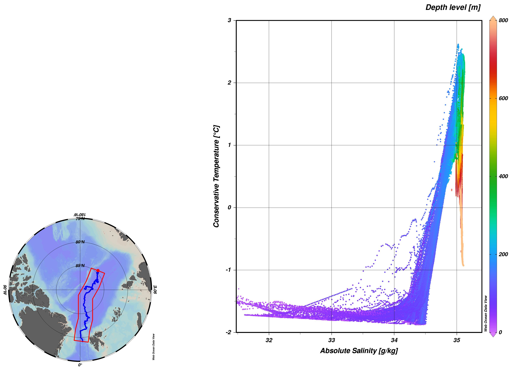
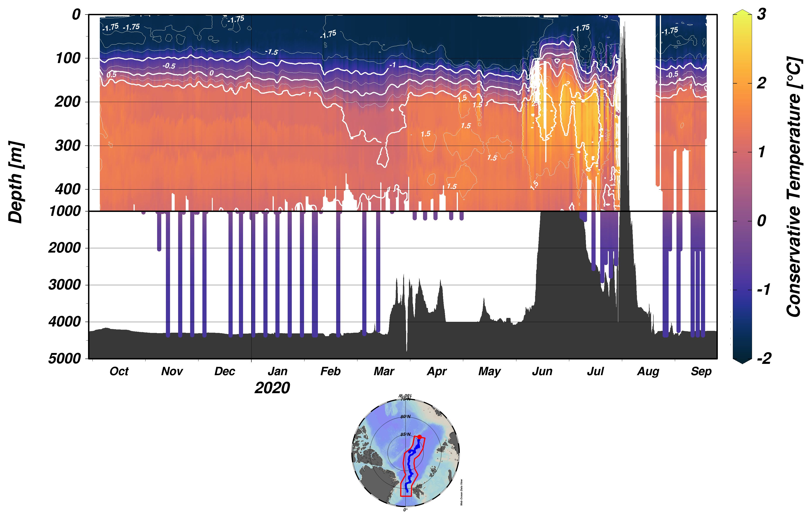
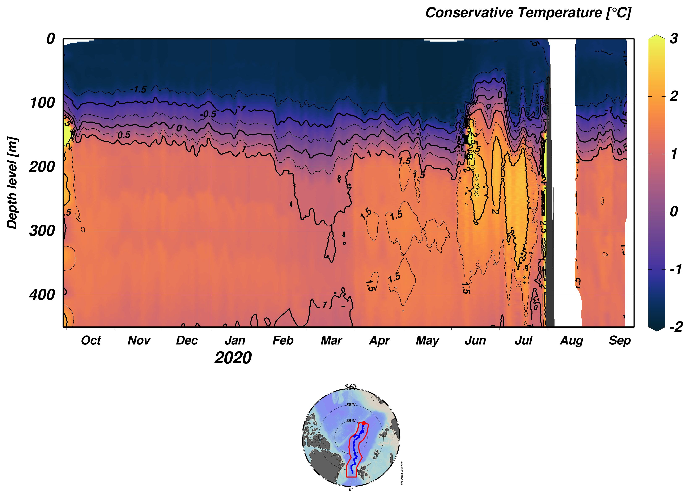
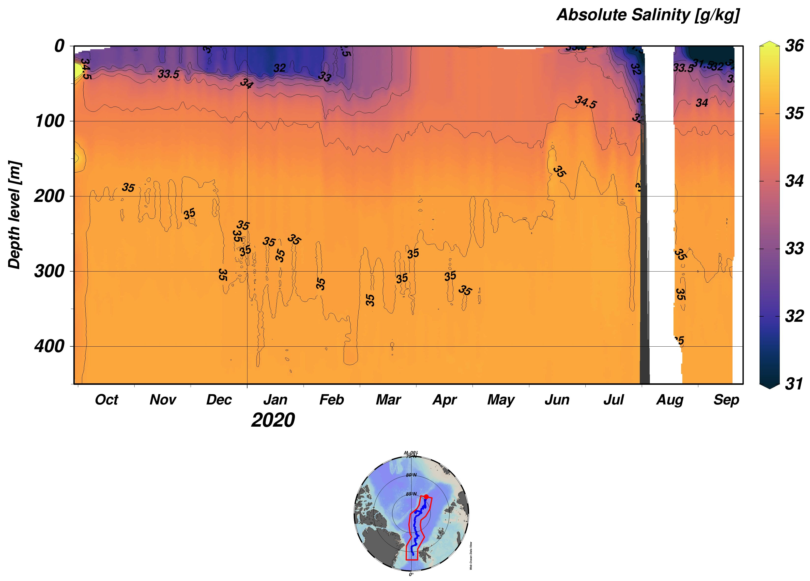
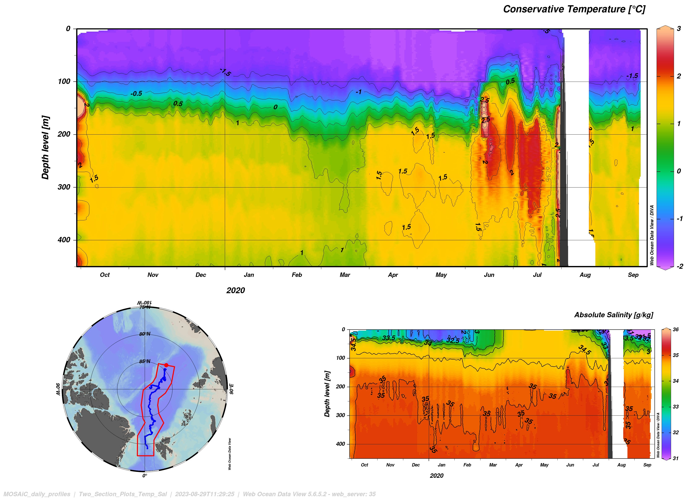
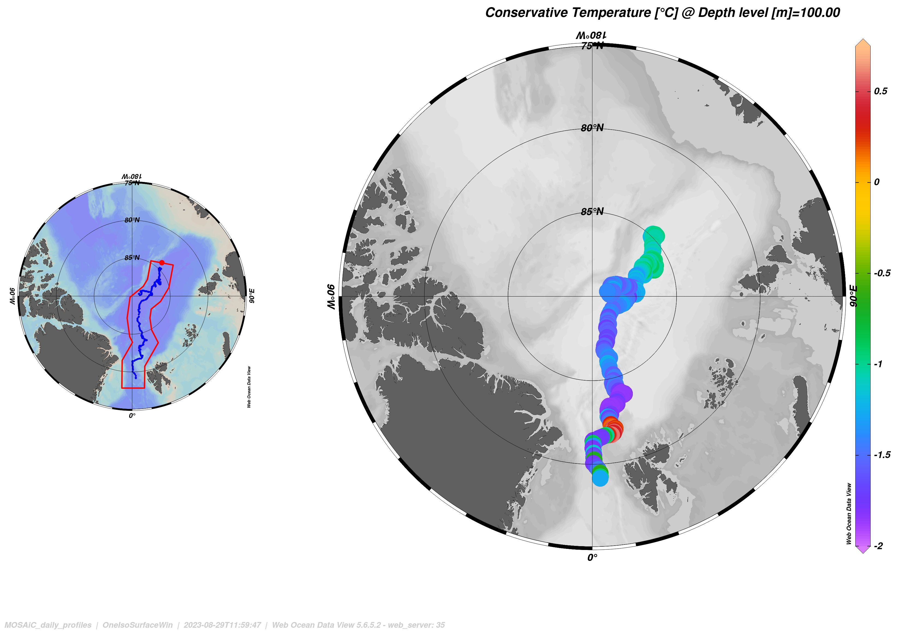

# mosaic_hydrographic_core_parameters

[MOSAiC](https://mosaic-expedition.org/) has been the largest polar
expedition in history. The German icebreaker Polarstern was trapped in
the ice from October 2019 to October 2020. As an international effort,
more than hundred scientists have taken meaurements during the polar
night. The [M-VRE team](https://mosaic-vre.org/team) aims at
aggregating and compiling this unique, comprehensive and
interdisciplinary dataset for the interactive online usage and
analysis with webODV (https://webodv.awi.de).

The ocean team has published an article *"The Eurasian Arctic Ocean
along the MOSAiC drift (2019-2020): An interdisciplinary perspective
on properties and processes"* in ELEMENTA - Science of the
Anthropocene led by Kirstin Schulz (University of Texas at Austin).

The averaged data used in the article are provided for online visualization,
analysis or as download at webODV (https://mvre.webodv.cloud.awi.de/).

In addition we have prepared visualizations or "Views" as we call it,
resembling parts of the analyses shown in the article and more. webODV
(https://mvre.webodv.cloud.awi.de/) allows immediately to start
working with the data and the Views.

### Video Tutorials: https://mosaic-vre.org/videos/webodv

### Documentation: https://mosaic-vre.org/docs

### Access
To immediatley access the View, go to https://mvre.webodv.cloud.awi.de
and login e.g. anonymously via the green button. Then browse directly
to e.g.
https://mvre.webodv.cloud.awi.de/Ocean>Hydrographic_Core_Parameters>MOSAiC_dailyaverage_skalars/service/DataExploration
or navigate through the "treeview", i.e. Ocean -> Hydrographic Core
Parameters -> MOSAiC dailyaverage skalars. Then on the next page click
on "Data Exploration". webODV opens the data collection.

Now click with the right mouse button into the white screen area and from the
context menu choose "Load View". A pop up window opens, where you can
select the View SSS_SST and start working.

### Archive
In addition we have archived the View here in Github. You can also
download the file "SSS_SST.xview" to your computer. In webODV open
the MOSAiC dailyaverage skalars collections with the "Data
Exploration" Service as above. In the top status bar go to "View" ->
"Manage Views" and upload the "SSS_SST.xview" file. Then select it
as explained above.

### Full data download
Full data download (.txt, .nc, .odv) or subsamples of the data are
available via webODV using the "Data Extraction" service or the "Data
Exploration" service. Here you can download the full collection via
the status bar menu "Export" -> "Data". Additionally, .nc files are
provided here in GitHub (MOSAiC_dailyaverage_skalars.nc [79k],
MOSAiC_daily_profiles.nc [45M])).

### How to download exactly the data from the View
You can also download only the data shown
in the plot e.g. the SSS_SST. Therefore go to "Export" -> "Window Data" -> "Window 1"
or/and "Window 2". If you choose "Window 1", the Salinity data will be
downloaded, choosing "Window 2" will download the Temperature data.

For more details how to work with webODV consider the links to the
documentation above.

Following Views are available
<pre>

</pre>
## SSS_SST

The figure below shows a view of the *Surface Absolute Salinity*
vs. the *Surface Conservative Temperature* over the length of the
MOSAiC expedition.

### Link: https://mvre.webodv.cloud.awi.de/Ocean>Hydrographic_Core_Parameters>MOSAiC_dailyaverage_skalars/service/DataExploration

### Treepath: Ocean -> Hydrographic Core Parameters -> MOSAiC dailyaverage skalars

### View: SSS_SST
<pre>

</pre>
## Temperature vs. Salinity

A temperature vs. salinity scatterplot is provided in "TS.xview"

### Link: https://mvre.webodv.cloud.awi.de/Ocean>Hydrographic_Core_Parameters>MOSAiC_daily_profiles/service/DataExploration

### Treepath: Ocean -> Hydrographic Core Parameters -> MOSAiC daily profiles

### View: TS
<pre>

</pre>
## Temperature Section overlay plot

A sophisticated temperature section plot is provided in "Temp_Section_v1.xview"

### Link: https://mvre.webodv.cloud.awi.de/Ocean>Hydrographic_Core_Parameters>MOSAiC_daily_profiles/service/DataExploration

### Treepath: Ocean -> Hydrographic Core Parameters -> MOSAiC daily profiles

### View: Temp_Section_v1
<pre>

</pre>
## Temperature Section 

A simple temperature section plot is provided in "Temp_Section.xview"

### Link: https://mvre.webodv.cloud.awi.de/Ocean>Hydrographic_Core_Parameters>MOSAiC_daily_profiles/service/DataExploration

### Treepath: Ocean -> Hydrographic Core Parameters -> MOSAiC daily profiles

### View: Temp_Section
<pre>

</pre>
## Salinity Section 

A simple salinity section plot is provided in "Sal_Section.xview"

### Link: https://mvre.webodv.cloud.awi.de/Ocean>Hydrographic_Core_Parameters>MOSAiC_daily_profiles/service/DataExploration

### Treepath: Ocean -> Hydrographic Core Parameters -> MOSAiC daily profiles

### View: Sal_Section
<pre>

</pre>
## Two section plot Temperature and Salinity 

Two section plots are provided in "Two_Section_Plots_Temp_Sal.xview"

### Link: https://mvre.webodv.cloud.awi.de/Ocean>Hydrographic_Core_Parameters>MOSAiC_daily_profiles/service/DataExploration

### Treepath: Ocean -> Hydrographic Core Parameters -> MOSAiC daily profiles

### View: Two_Section_Plots_Temp_Sal
<pre>

</pre>
## Iso-surface plot of Temperature at a depth of 100m

Iso-surface plot "Iso_Surface_Temp_At_100m.xview"

### Link: https://mvre.webodv.cloud.awi.de/Ocean>Hydrographic_Core_Parameters>MOSAiC_daily_profiles/service/DataExploration

### Treepath: Ocean -> Hydrographic Core Parameters -> MOSAiC daily profiles

### View: Iso_Surface_Temp_At_100m
